# Data Quality Gate System

An end-to-end **Data Engineering pipeline** that takes raw data from ingestion all the way to a governed, trusted state ready for decision-making — built on a layered architecture with automated orchestration and built-in data quality and security controls.

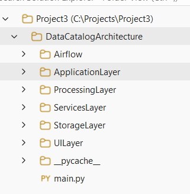

---

## 🎯 Purpose

> Ensure that any data entering the system is **reliable, clean, and secure** before it is used for reporting or decision-making.

The system is built around three core principles:

- **Layered Architecture** — each concern (UI, orchestration, processing, storage) is isolated and independently replaceable
- **Automation & Orchestration** — the full pipeline can run end-to-end with no manual intervention
- **Data Quality & Governance** — every dataset is validated, scored, and audited before it reaches the warehouse

---

## 🏗️ Architecture Overview

The system is organized into four core layers that communicate through a shared Storage Layer:

| Layer | Role |
|---|---|
| **Application Layer** (Streamlit UI) | The single entry point for the user. Holds no processing logic — every action is forwarded to the backend as an HTTP request, and the page renders whatever response comes back. |
| **Services Layer** (FastAPI) | The orchestration brain. Receives requests from the UI, decides which layer runs and in what order, and exposes the API endpoints. |
| **Processing Layer** (Apache Spark) | Executes the heavy lifting — cleaning, transformations, and validation — kept separate to preserve Spark session stability across requests. |
| **Storage Layer** (Data Lake) | The backbone of the system. Every layer reads from and writes to it, which keeps the layers decoupled and prevents data duplication. |

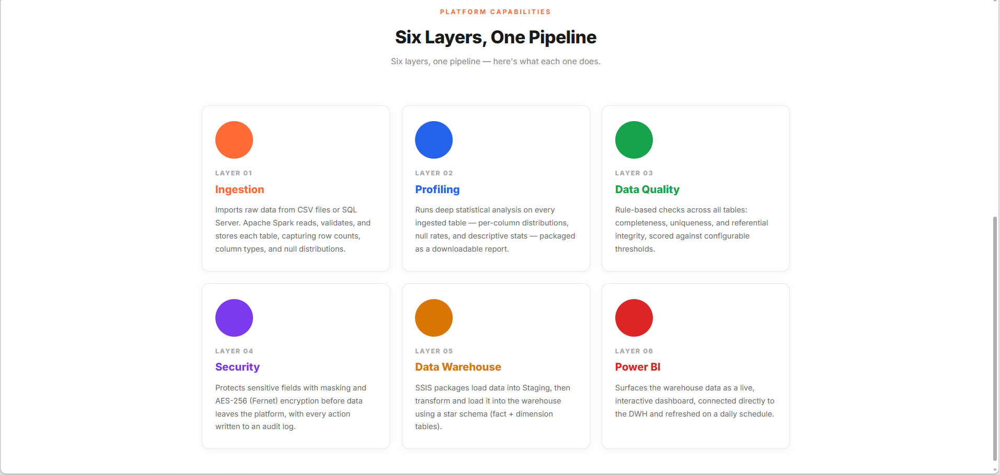

---

## 🧱 Pipeline Layers

### 1️⃣ Ingestion Layer
Reads raw data from uploaded CSV files or directly from a SQL Server instance via Apache Spark, and stores it unmodified to preserve data lineage and allow tracing back to the original source.

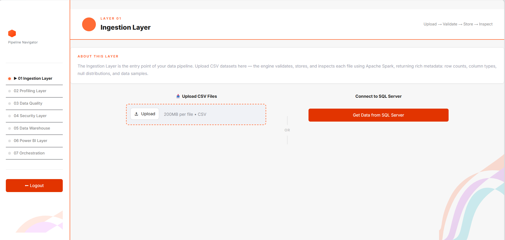

### 2️⃣ Profiling Layer
Runs statistical profiling on every ingested table — missing values, data types, distributions — and exports the result as a downloadable HTML report, to understand the data before judging it.

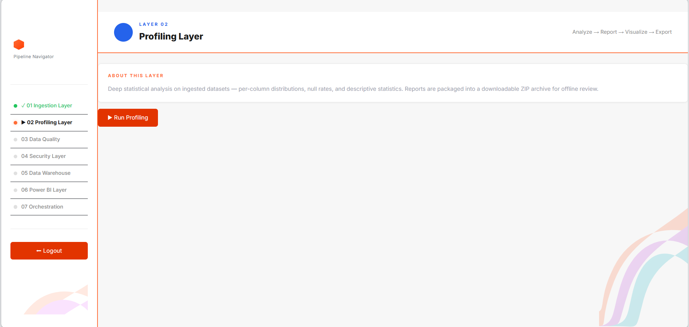

### 3️⃣ Data Quality Layer 🔥
The core of the system. Applies rule-based data quality checks using **Great Expectations** across six dimensions:

| Dimension | Question it answers |
|---|---|
| Completeness | Are there missing values? |
| Uniqueness | Are there duplicates? |
| Consistency | Are there contradictions? |
| Validity | Are values within an accepted range? |
| Accuracy | Are the values correct? |
| Timeliness | Is the data up to date? |

Beyond one-time validation, this layer supports ongoing monitoring and error tracking — the core idea of a **trusted data pipeline**.

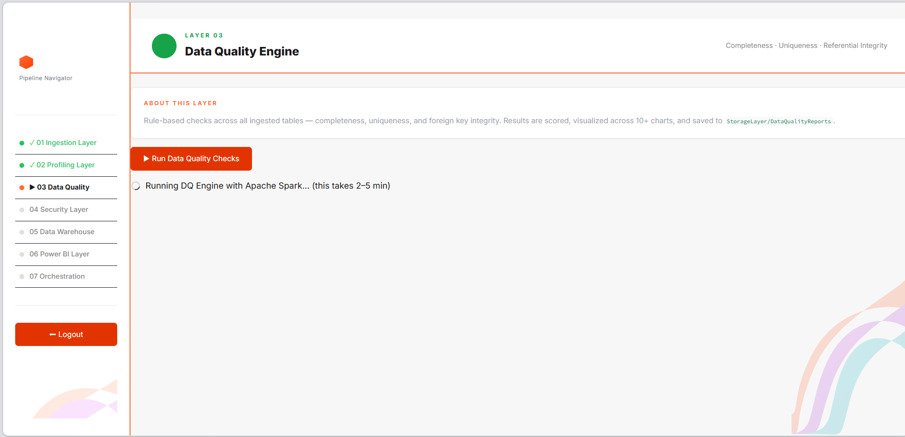

### 4️⃣ Security Layer
Masks and encrypts sensitive fields using **AES-256 (Fernet)** before the data leaves the platform, with every action logged to an audit trail.

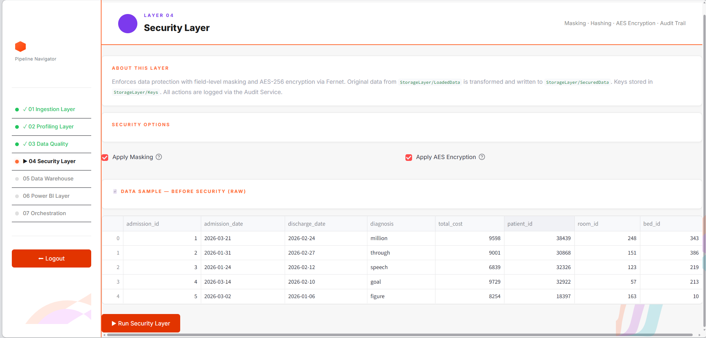

### 5️⃣ Data Warehouse Layer
Loads secured data into a Staging schema via **SSIS**, then transforms and loads it into the warehouse using a **star schema** of fact and dimension tables — optimized for analytical performance.

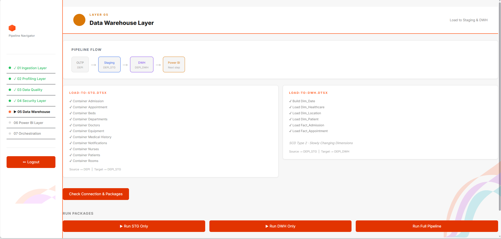

### 6️⃣ Visualization Layer (Power BI)
Surfaces the warehouse data as a live, interactive dashboard connected directly to the DWH, to support insight extraction and decision-making.

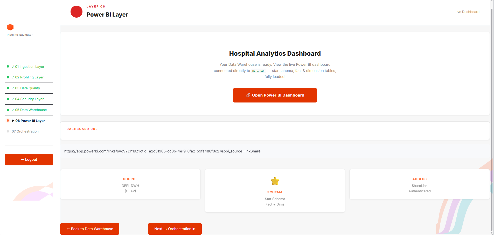

### 7️⃣ Orchestration Layer (Apache Airflow)
Coordinates the full pipeline — scheduling, dependency management, and monitoring — enabling the entire system to run end-to-end automatically.

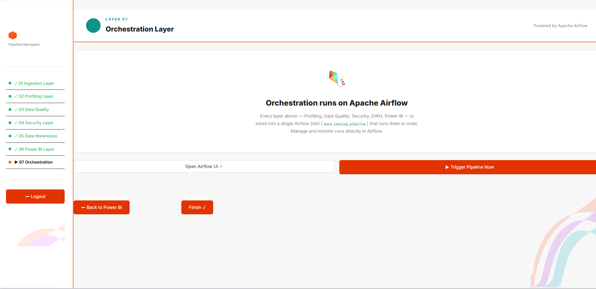

---

## 🔄 How It Works (Request Flow)

1. The user triggers an action from the Streamlit UI
2. The request is sent to the FastAPI backend
3. The Services Layer determines which operation to run and in what order
4. The Processing Layer executes it using Apache Spark
5. Results are written to the Storage Layer
6. Each pipeline layer runs in sequence — or the entire flow can be triggered automatically via Airflow

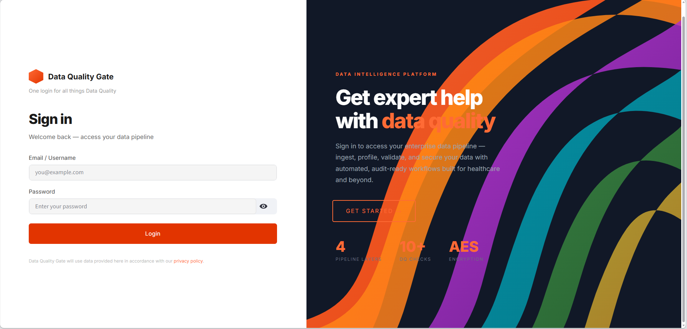

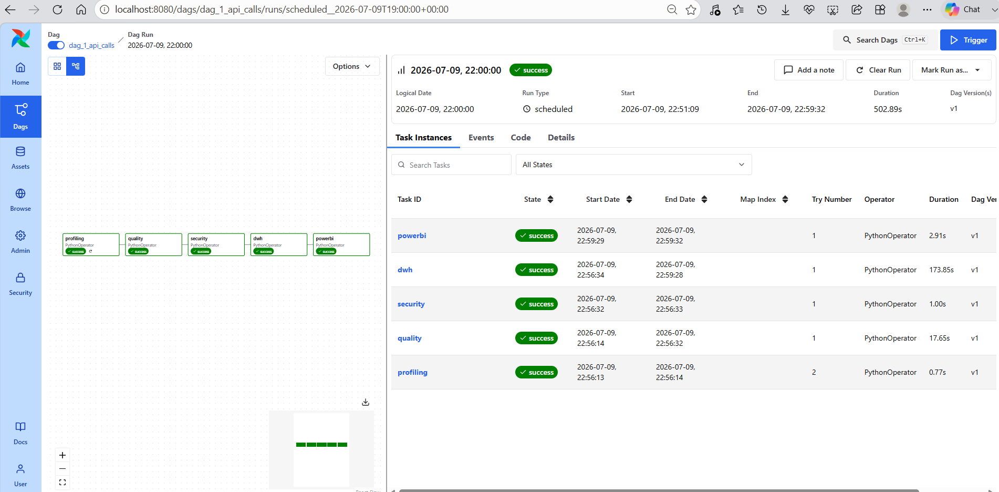

---

## ⚙️ Tech Stack

| Category | Technology |
|---|---|
| Frontend | Streamlit |
| Backend | FastAPI |
| Processing | Apache Spark (PySpark) |
| Data Quality | Great Expectations |
| Security | Cryptography (Fernet / AES-256) |
| Data Warehouse | SQL Server + SSIS |
| BI / Visualization | Power BI |
| Orchestration | Apache Airflow |

---

## 🚀 Setup

### Prerequisites

- Python 3.9+ (built/tested on 3.9.25, Anaconda distribution)
- Java JDK 17 (required by PySpark — set `JAVA_HOME`)
- Microsoft SQL Server (Developer or Express) reachable from the machine
- Microsoft ODBC Driver 17/18 for SQL Server
- Git
- Docker Desktop (for the Orchestration/Airflow layer)
- Power BI Desktop (only needed to republish the dashboard)

### Installation

```bash
# clone the project
git clone https://github.com/Elzadey/Data-Quality-Gate-pipeline.git
cd Data-Quality-Gate-pipeline

# create and activate environment
conda create -n dqgate python=3.9
conda activate dqgate

# install dependencies
pip install -r requirements.txt
```

### Configuration

Before running on a new machine, update:
- `SQL_SERVER_INSTANCE` in `ProcessingLayer/ingestion/spark_loader.py` → your own SQL Server instance name
- The Power BI dashboard URL in `PowerBI.py`
- The `.dtsx` connection managers under `ProcessingLayer/DWH/DWH/` (for SSIS)

### Running

```bash
# 1. Start SQL Server and confirm the databases are reachable

# 2. Start Docker + Airflow
docker compose up -d

# 3. Start the FastAPI backend
python -m uvicorn main:app --reload --port 8000

# 4. Start the Streamlit UI
streamlit run shima.py
```

Then open the app in your browser, log in, and run the layers in sequence from the Pipeline Navigator sidebar — or trigger the full pipeline from the Orchestration page.

---

## 🗂️ Project Structure

```
Data-Quality-Gate-pipeline/
├── ProcessingLayer/     # Ingestion, DWH (SSIS packages)
├── ServicesLayer/       # Profiling, Data Quality, Security services
├── ApplicationLayer/    # FastAPI backend (main.py)
├── UI/                  # Streamlit app (shima.py)
├── Pictures/            # Screenshots used in this README
├── requirements.txt
└── docker-compose.yml
```

---

## 📝 Notes

- The login page is currently a UI-side check only (no real authentication) — hardening it into a proper `/auth/login` endpoint is a recommended next step before production use.
- Encryption keys are kept locally (`Keys/` folder or environment variables) and are **not** committed to source control.
- This is more than a data pipeline — it's a framework that ensures data is clean, secure, and trustworthy before it's used to make decisions.
